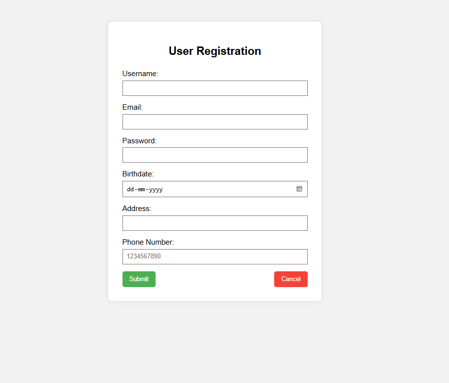

# 📝 User Registration Form

This is a simple and responsive **User Registration Form** built with pure HTML and CSS. It includes fields for collecting user information such as username, email, password, birthdate, address, and phone number. The form also features "Submit" and "Cancel" buttons for user interaction.

---

## 🚀 Features

- Username, Email, Password, Birthdate, Address, and Phone Number fields
- Form validation using appropriate input types
- Responsive and clean design using CSS
- Ready to deploy on GitHub Pages

---

## 📷 Screenshots

### 🔹 Form Interface

### 🔹 Mobile View

---

## 🌐 Live Demo

👉 [Click here to view the live form](https://your-username.github.io/registration-form/)

---

## 📁 File Structure

